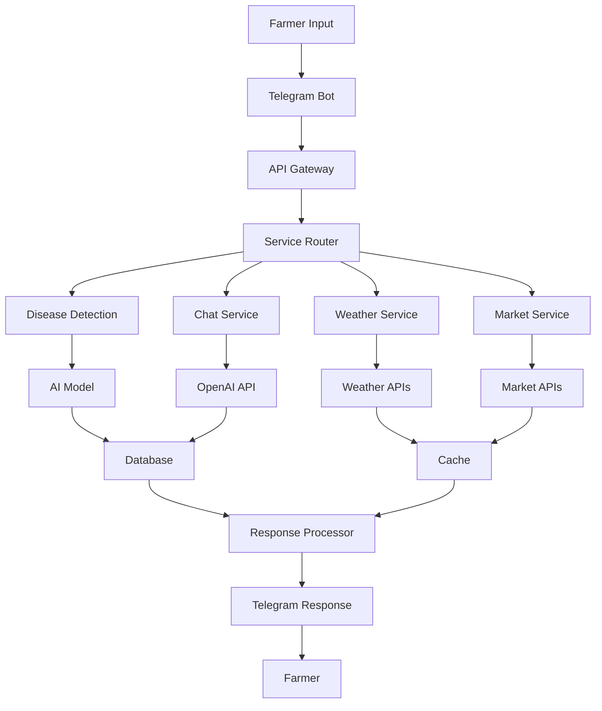

# 🌐 KisanAI Data Sources & Integrations

> **Comprehensive guide to all data sources, APIs, and external integrations powering KisanAI**

---

## 📋 **Table of Contents**

1. [Government Data Sources](#government-data-sources)
2. [Weather & Climate APIs](#weather--climate-apis)
3. [Agricultural Databases](#agricultural-databases)
4. [AI/ML Services](#aiml-services)
5. [Communication Platforms](#communication-platforms)
6. [Market & Financial Data](#market--financial-data)
7. [Language & Translation Services](#language--translation-services)
8. [Monitoring & Analytics](#monitoring--analytics)
9. [Integration Architecture](#integration-architecture)
10. [Data Quality & Reliability](#data-quality--reliability)

---

## 🏛️ **Government Data Sources**

### **Ministry of Agriculture & Farmers Welfare APIs**

#### **Agmarknet Portal**
```yaml
Name: Agricultural Marketing Division
URL: https://agmarknet.gov.in/
Purpose: Real-time market prices across India
Data Coverage:
  - 3,000+ markets (APMCs)
  - 300+ commodities
  - Daily price updates
  - Historical price trends (10+ years)

API Endpoints:
  Base URL: https://api.agmarknet.gov.in/nav/public/
  Authentication: API Key required
  Rate Limits: 1000 requests/hour
  
Key Endpoints:
  - GET /prices/commodity/{id}
  - GET /markets/state/{state_code}
  - GET /historical/prices/{commodity}/{market}
  
Response Format:
  {
    "commodity": "Tomato",
    "market": "Delhi",
    "min_price": 1500,
    "max_price": 2500,
    "modal_price": 2000,
    "date": "2025-06-30",
    "unit": "Quintal"
  }
```

#### **eNAM (National Agriculture Market)**
```yaml
Name: Electronic National Agriculture Market
URL: https://www.enam.gov.in/
Purpose: Online trading platform integration
Data Coverage:
  - 1,000+ integrated markets
  - Quality parameters
  - Trade data
  - Farmer registration info

Integration Points:
  - Market arrivals data
  - Quality testing results
  - Price discovery mechanism
  - Farmer-buyer connections
```

#### **PM-KISAN Portal**
```yaml
Name: Pradhan Mantri Kisan Samman Nidhi
URL: https://pmkisan.gov.in/
Purpose: Farmer benefit scheme information
Data Available:
  - Beneficiary status
  - Payment history
  - Eligibility criteria
  - Application procedures

API Features:
  - Real-time status check
  - Document verification
  - Payment tracking
  - Grievance management
```

### **State Government Portals**

#### **Karnataka - Bhoomi Portal**
```yaml
Platform: Karnataka Land Records
URL: https://landrecords.karnataka.gov.in/
Data: Land ownership, survey numbers, crop patterns
Integration: Land verification for farmer authentication
```

#### **Andhra Pradesh - AP Land Records**
```yaml
Platform: AP Land Records Management
URL: https://webland.ap.gov.in/
Data: Pahani details, ownership records, crop data
Integration: Farmer verification and crop history
```

#### **Maharashtra - Mahabhumi**
```yaml
Platform: Maharashtra Land Records
URL: https://mahabhumi.gov.in/
Data: 7/12 extracts, land ownership, crop patterns
Integration: Farmer identity verification
```

---

## 🌤️ **Weather & Climate APIs**

### **India Meteorological Department (IMD)**

#### **Official IMD API**
```yaml
Provider: India Meteorological Department
URL: https://mausam.imd.gov.in/
Coverage: All of India with 4km resolution
Update Frequency: Every 3 hours

Endpoints:
  - Current weather conditions
  - 7-day weather forecast
  - Rainfall predictions
  - Extreme weather alerts
  - Agro-meteorological advisories

Data Points:
  - Temperature (min/max)
  - Humidity levels
  - Wind speed and direction
  - Rainfall (past and predicted)
  - UV index
  - Soil temperature
```

#### **IMD Agro-met Advisory**
```yaml
Service: Agromet Advisory Service (AAS)
Coverage: 130 districts across India
Language: Local languages + English/Hindi
Content:
  - Crop-specific advisories
  - Pest and disease warnings
  - Irrigation recommendations
  - Harvesting guidance

Integration:
  district_code: "KA_Bangalore_Rural"
  crop_stage: "flowering"
  advisory_type: "irrigation"
  language: "kannada"
```

### **OpenWeatherMap API**

#### **Current Weather & Forecasts**
```yaml
Provider: OpenWeatherMap
URL: https://openweathermap.org/api
Global Coverage: Yes, excellent India coverage
Rate Limits: 1000 calls/day (free), 60 calls/minute

Key APIs:
  - Current Weather Data
  - 5 Day / 3 Hour Forecast
  - Weather Maps
  - Weather Alerts
  - Historical Weather Data

Sample Request:
  GET https://api.openweathermap.org/data/2.5/weather
  ?lat=12.9716&lon=77.5946&appid={API_KEY}
  &units=metric&lang=hi

Response Data:
  {
    "main": {
      "temp": 28.5,
      "humidity": 68,
      "pressure": 1013
    },
    "weather": [{
      "main": "Rain",
      "description": "moderate rain"
    }],
    "wind": {
      "speed": 3.2,
      "deg": 245
    }
  }
```

#### **Agriculture-Specific Data**
```yaml
Agro API: OpenWeatherMap Agro API
Features:
  - Soil data (temperature, moisture)
  - Vegetation indices (NDVI, EVI)
  - Weather history for fields
  - Accumulated precipitation
  - Growing degree days

Sample Soil Data:
  {
    "dt": 1625097600,
    "t0": 18.5,    // Soil temp at surface
    "t10": 19.2,   // Soil temp at 10cm
    "moisture": 0.3, // Soil moisture
    "pressure": 1013.25
  }
```

### **AccuWeather API**

#### **Professional Agriculture Solutions**
```yaml
Provider: AccuWeather
URL: https://developer.accuweather.com/
Specialty: High-precision local forecasts
Coverage: 15-minute intervals for India

Agriculture APIs:
  - Field-level forecasts
  - Frost warnings
  - Heat stress indices
  - Spray window recommendations
  - Harvest conditions

Field Monitoring:
  field_id: "farm_bangalore_field_01"
  coordinates: [12.9716, 77.5946]
  crop_type: "tomato"
  growth_stage: "flowering"
```

---

## 🌾 **Agricultural Databases**

### **ICAR Research Data**

#### **Indian Council of Agricultural Research**
```yaml
Organization: ICAR (Indian Council of Agricultural Research)
URL: https://icar.org.in/
Databases:
  - National Bureau of Plant Genetic Resources
  - Central Research Institute databases
  - Crop protection databases
  - Soil health databases

Research Data:
  - 50,000+ crop varieties
  - Disease and pest databases
  - Soil fertility maps
  - Best practice guidelines
  - Research publications
```

#### **NBPGR (Plant Genetic Resources)**
```yaml
Database: National Bureau of Plant Genetic Resources
Content:
  - Germplasm collections
  - Crop characterization data
  - Genetic diversity information
  - Conservation strategies

Integration Use:
  - Variety recommendations
  - Crop suitability analysis
  - Genetic resistance information
  - Breeding program data
```

### **International Databases**

#### **CABI (Centre for Agriculture and Biosciences International)**
```yaml
Provider: CABI International
URL: https://www.cabi.org/
Databases:
  - Crop Protection Compendium
  - Invasive Species Compendium
  - Plantwise Knowledge Bank

Disease Information:
  {
    "disease_id": "tomato_early_blight",
    "scientific_name": "Alternaria solani",
    "hosts": ["tomato", "potato", "eggplant"],
    "symptoms": "Brown spots with concentric rings",
    "management": {
      "cultural": "Crop rotation, resistant varieties",
      "chemical": "Copper-based fungicides",
      "biological": "Trichoderma species"
    }
  }
```

#### **FAO GIEWS (Global Information and Early Warning System)**
```yaml
Provider: UN Food and Agriculture Organization
URL: https://www.fao.org/giews/
Data:
  - Global crop production forecasts
  - Food security indicators
  - Market price trends
  - Weather impact assessments

Country Reports:
  - India agricultural outlook
  - Regional food security
  - Trade flow analysis
  - Policy impact studies
```

### **Research Institution APIs**

#### **ICRISAT (International Crops Research Institute)**
```yaml
Organization: ICRISAT
Focus: Semi-arid tropics (perfect for India)
Databases:
  - Crop modeling data
  - Weather data archives
  - Soil characterization
  - Variety performance data

Climate Data:
  location: "Hyderabad"
  soil_type: "Vertisol"
  rainfall_pattern: "monsoon_dependent"
  recommended_crops: ["sorghum", "millet", "chickpea"]
```

---

## 🤖 **AI/ML Services**

### **OpenAI Services**

#### **GPT-4 Integration**
```yaml
Provider: OpenAI
Model: GPT-4-turbo
Use Cases:
  - Multilingual chat assistance
  - Agricultural knowledge queries
  - Pest identification descriptions
  - Treatment recommendations

API Configuration:
  model: "gpt-4-turbo"
  max_tokens: 1000
  temperature: 0.7
  system_prompt: |
    You are KisanAI, an expert agricultural assistant for Indian farmers.
    Provide practical, actionable advice in simple language.
    Always consider local Indian conditions and practices.

Sample Request:
  {
    "model": "gpt-4-turbo",
    "messages": [
      {
        "role": "system",
        "content": "You are an agricultural expert for Indian farmers..."
      },
      {
        "role": "user", 
        "content": "मेरे टमाटर के पत्तों पर भूरे धब्बे हैं, क्या करूं?"
      }
    ]
  }
```

#### **DALL-E Integration (Future)**
```yaml
Model: DALL-E 3
Purpose: Generate visual guides for farmers
Use Cases:
  - Pest identification images
  - Disease progression visuals
  - Treatment step illustrations
  - Equipment usage diagrams
```

### **Google AI Services**

#### **Vertex AI Platform**
```yaml
Platform: Google Cloud Vertex AI
Services Used:
  - AutoML Vision (custom disease detection)
  - Natural Language API (text processing)
  - Translation API (language support)
  - Text-to-Speech API (voice responses)

Custom Models:
  - Disease Detection Model (TensorFlow)
  - Crop Classification Model
  - Pest Identification Model
  - Multilingual Text Classification
```

#### **Google Vision AI**
```yaml
Service: Google Cloud Vision API
Capabilities:
  - Image classification
  - Object detection
  - OCR for documents
  - Safe search detection

Agricultural Applications:
  - Crop health assessment
  - Disease symptom detection
  - Pest identification
  - Soil condition analysis

API Example:
  POST https://vision.googleapis.com/v1/images:annotate
  {
    "requests": [{
      "image": {"content": "base64_image_data"},
      "features": [
        {"type": "LABEL_DETECTION", "maxResults": 10},
        {"type": "OBJECT_LOCALIZATION", "maxResults": 10}
      ]
    }]
  }
```

### **Hugging Face Models**

#### **Open Source Language Models**
```yaml
Platform: Hugging Face
Models Used:
  - sentence-transformers/all-MiniLM-L6-v2 (embeddings)
  - google/mt5-base (multilingual text)
  - ai4bharat/indic-bert (Indian languages)

Local Deployment:
  from transformers import pipeline
  
  classifier = pipeline(
    "text-classification",
    model="ai4bharat/indic-bert",
    tokenizer="ai4bharat/indic-bert"
  )
  
  result = classifier("यह फसल में कौन सी बीमारी है?")
```

---

## 📱 **Communication Platforms**

### **Telegram Bot API**

#### **Core Bot Features**
```yaml
Platform: Telegram
Bot Username: @KisanAIBot
API Version: Bot API 6.0+
Features:
  - Image upload and processing
  - Voice message support
  - Inline keyboards
  - File downloads
  - Location sharing

Webhook Configuration:
  URL: https://api.kisanai.com/webhook/telegram
  Max Connections: 40
  Allowed Updates: ["message", "callback_query", "inline_query"]

Message Types Handled:
  - Text messages (questions)
  - Photo messages (disease detection)
  - Voice messages (speech-to-text)
  - Location messages (weather data)
  - Document messages (soil reports)
```

#### **Advanced Features**
```javascript
// Inline keyboard for quick responses
const diseaseKeyboard = {
  inline_keyboard: [
    [
      { text: "🔬 More Details", callback_data: "disease_details_123" },
      { text: "💊 Treatments", callback_data: "treatments_123" }
    ],
    [
      { text: "🌱 Prevention Tips", callback_data: "prevention_123" },
      { text: "📞 Expert Help", callback_data: "expert_contact" }
    ]
  ]
};

// Voice message processing
bot.on('voice', async (msg) => {
  const fileId = msg.voice.file_id;
  const file = await bot.getFile(fileId);
  const audioUrl = `https://api.telegram.org/file/bot${BOT_TOKEN}/${file.file_path}`;
  
  // Convert speech to text
  const transcript = await speechToText(audioUrl, msg.from.language_code);
  
  // Process agricultural query
  const response = await processAgriculturalQuery(transcript);
  
  // Send text and voice response
  await bot.sendMessage(msg.chat.id, response.text);
  await bot.sendVoice(msg.chat.id, await textToSpeech(response.text));
});
```

### **WhatsApp Business API** (Future Integration)

#### **WhatsApp Cloud API**
```yaml
Provider: Meta (WhatsApp)
API: WhatsApp Cloud API
Features:
  - Rich media messages
  - Interactive buttons
  - Template messages
  - Broadcast capabilities

Planned Integration:
  Phone Number: +91-XXXXX-XXXXX
  Business Verification: Required
  Template Approval: Government notification templates

Message Templates:
  - Weather alerts
  - Market price updates
  - Disease outbreak warnings
  - Government scheme notifications
```

---

## 💰 **Market & Financial Data**

### **Commodity Price APIs**

#### **Multi Commodity Exchange (MCX)**
```yaml
Exchange: Multi Commodity Exchange of India
URL: https://www.mcxindia.com/
Data:
  - Futures prices
  - Spot market rates
  - Price trends
  - Trading volumes

Commodities Covered:
  - Agricultural: Wheat, Rice, Cotton, Sugar
  - Spices: Turmeric, Coriander, Cardamom
  - Oils: Soybean, Mustard, Castor

API Response:
  {
    "commodity": "Wheat",
    "contract": "Jul2025",
    "last_price": 2650,
    "change": "+25",
    "volume": 12500,
    "open_interest": 45000
  }
```

#### **National Sample Survey Office (NSSO)**
```yaml
Organization: Ministry of Statistics & Programme Implementation
Data:
  - Household consumption patterns
  - Agricultural statistics
  - Rural economic indicators
  - Price indices

Rural Price Data:
  - Village-level prices
  - Seasonal variations
  - Regional comparisons
  - Inflation indicators
```

### **Banking & Financial Services**

#### **Jan Aushadhi Portal** (Farmer Financial Schemes)
```yaml
Portal: Pradhan Mantri Jan Aushadhi Portal
Integration: Linking agricultural schemes
Data:
  - Scheme eligibility
  - Application status
  - Disbursement tracking
  - Document requirements

Financial Products:
  - Kisan Credit Card
  - Crop Insurance
  - Soil Health Card funding
  - Equipment subsidies
```

#### **Bank APIs** (Future Integration)
```yaml
Integration Plan: Open Banking APIs
Purpose: Financial service recommendations
Features:
  - Loan eligibility checking
  - Insurance product matching
  - Government subsidy tracking
  - Digital payment facilitation

Potential Partners:
  - State Bank of India
  - HDFC Bank
  - ICICI Bank
  - Regional Rural Banks
```

---

## 🗣️ **Language & Translation Services**

### **Bhashini Platform**

#### **National Language Translation Mission**
```yaml
Platform: Bhashini (Government of India)
URL: https://bhashini.gov.in/
Purpose: Digital India language technology
Languages: 22 official Indian languages

Services:
  - Real-time translation
  - Speech-to-text (ASR)
  - Text-to-speech (TTS)
  - Natural language understanding

API Endpoints:
  - POST /v1/translate
  - POST /v1/asr (Automatic Speech Recognition)  
  - POST /v1/tts (Text-to-Speech)
  - POST /v1/transliterate

Language Codes:
  hi: Hindi
  bn: Bengali
  te: Telugu
  ta: Tamil
  ml: Malayalam
  kn: Kannada
  gu: Gujarati
  mr: Marathi
  pa: Punjabi
  or: Odia
```

#### **Integration Example**
```javascript
// Bhashini translation service
const translateText = async (text, sourceLang, targetLang) => {
  const response = await fetch('https://api.bhashini.gov.in/v1/translate', {
    method: 'POST',
    headers: {
      'Authorization': `Bearer ${BHASHINI_API_KEY}`,
      'Content-Type': 'application/json'
    },
    body: JSON.stringify({
      text: text,
      source_language: sourceLang,
      target_language: targetLang,
      domain: 'agriculture'
    })
  });
  
  return response.json();
};

// Voice processing with regional languages
const processVoiceMessage = async (audioFile, language) => {
  // Speech-to-text in regional language
  const transcript = await bhashiniASR(audioFile, language);
  
  // Process agricultural query
  const response = await processQuery(transcript);
  
  // Convert response back to speech
  const audioResponse = await bhashiniTTS(response, language);
  
  return { text: response, audio: audioResponse };
};
```

### **Google Translate API**

#### **Fallback Translation Service**
```yaml
Provider: Google Cloud Translation
Coverage: 100+ languages
Use Case: Fallback when Bhashini unavailable

Advanced Features:
  - Document translation
  - Batch translation
  - Custom models
  - Translation confidence scores

API Configuration:
  projectId: "kisanai-translate"
  model: "nmt" // Neural Machine Translation
  format: "text"
  
Regional Optimization:
  - Hindi agricultural terminology
  - Regional crop names
  - Local measurement units
  - Cultural context preservation
```

---

## 📊 **Monitoring & Analytics**

### **Application Performance Monitoring**

#### **Sentry Error Tracking**
```yaml
Platform: Sentry
Purpose: Real-time error monitoring
Features:
  - Exception tracking
  - Performance monitoring
  - Release tracking
  - User feedback

Configuration:
  dsn: "https://xxx@sentry.io/project-id"
  environment: "production"
  tracesSampleRate: 0.1
  profilesSampleRate: 0.1

Custom Tags:
  - user_type: "farmer" | "expert" | "admin"
  - language: "hi" | "en" | "ta" | etc.
  - platform: "telegram" | "web" | "mobile"
  - feature: "disease_detection" | "chat" | "weather"
```

#### **Google Analytics**
```yaml
Platform: Google Analytics 4
Purpose: User behavior analysis
Events Tracked:
  - Disease detection requests
  - Chat interactions
  - Weather queries
  - Market price checks
  - Language preferences

Custom Dimensions:
  - Farmer location (state/district)
  - Crop types of interest
  - Preferred communication language
  - Device characteristics
  - Network connectivity
```

### **Infrastructure Monitoring**

#### **Uptime Monitoring**
```yaml
Service: UptimeRobot
Monitoring:
  - API endpoint availability
  - Response time tracking
  - SSL certificate monitoring
  - Database connectivity

Alerts:
  - Email notifications
  - Slack integration
  - SMS for critical issues
  - PagerDuty escalation

Endpoints Monitored:
  - https://api.kisanai.com/health
  - https://kisanai.com
  - Database connectivity
  - Redis cache status
```

#### **Performance Metrics**
```javascript
// Custom metrics collection
const performanceMetrics = {
  // Disease detection metrics
  diseaseDetectionLatency: new Histogram({
    name: 'disease_detection_duration_seconds',
    help: 'Time taken for disease detection',
    buckets: [0.1, 0.5, 1.0, 2.0, 5.0]
  }),
  
  // Chat response metrics
  chatResponseTime: new Histogram({
    name: 'chat_response_duration_seconds',
    help: 'Time taken for chat responses',
    buckets: [0.5, 1.0, 2.0, 5.0, 10.0]
  }),
  
  // User satisfaction metrics
  userSatisfaction: new Counter({
    name: 'user_satisfaction_total',
    help: 'User satisfaction ratings',
    labelNames: ['rating', 'feature']
  })
};
```

---

## 🏗️ **Integration Architecture**

### **API Gateway Pattern**

```yaml
Architecture: Microservices with API Gateway
Gateway: Kong / Express Gateway

Service Routing:
  /api/v1/diseases/*     → Disease Detection Service
  /api/v1/chat/*         → Chat Service  
  /api/v1/weather/*      → Weather Service
  /api/v1/market/*       → Market Data Service
  /api/v1/auth/*         → Authentication Service

Cross-Cutting Concerns:
  - Rate limiting
  - Authentication
  - Request logging
  - Response caching
  - Error handling
```

### **Data Flow Architecture**



### **Error Handling & Resilience**

```javascript
// Circuit breaker pattern for external APIs
const CircuitBreaker = require('opossum');

const weatherAPIOptions = {
  timeout: 3000,
  errorThresholdPercentage: 50,
  resetTimeout: 30000
};

const weatherBreaker = new CircuitBreaker(fetchWeatherData, weatherAPIOptions);

weatherBreaker.fallback(() => {
  return getCachedWeatherData();
});

// Retry mechanism with exponential backoff
const retryWithBackoff = async (fn, maxRetries = 3) => {
  for (let i = 0; i < maxRetries; i++) {
    try {
      return await fn();
    } catch (error) {
      if (i === maxRetries - 1) throw error;
      await new Promise(resolve => 
        setTimeout(resolve, Math.pow(2, i) * 1000)
      );
    }
  }
};
```

---

## ✅ **Data Quality & Reliability**

### **Data Validation Framework**

```javascript
// Zod schemas for data validation
const WeatherDataSchema = z.object({
  temperature: z.number().min(-50).max(60),
  humidity: z.number().min(0).max(100),
  rainfall: z.number().min(0),
  windSpeed: z.number().min(0),
  pressure: z.number().min(800).max(1200),
  location: z.object({
    latitude: z.number().min(-90).max(90),
    longitude: z.number().min(-180).max(180)
  }),
  timestamp: z.string().datetime()
});

const MarketPriceSchema = z.object({
  commodity: z.string().min(1),
  market: z.string().min(1),
  price: z.number().positive(),
  unit: z.enum(['quintal', 'kg', 'tonnes']),
  date: z.string().date(),
  source: z.enum(['agmarknet', 'enam', 'mcx'])
});

// Data quality checks
const validateData = (data, schema) => {
  try {
    return schema.parse(data);
  } catch (error) {
    logger.warn('Data validation failed', { error, data });
    throw new DataValidationError(error.message);
  }
};
```

### **Data Freshness Monitoring**

```javascript
// Check data freshness across sources
const dataFreshnessCheck = {
  weather: {
    maxAge: 30 * 60 * 1000, // 30 minutes
    source: 'openweather'
  },
  marketPrices: {
    maxAge: 24 * 60 * 60 * 1000, // 24 hours
    source: 'agmarknet'
  },
  diseaseDatabase: {
    maxAge: 7 * 24 * 60 * 60 * 1000, // 7 days
    source: 'icar'
  }
};

const checkDataFreshness = async (dataType) => {
  const config = dataFreshnessCheck[dataType];
  const lastUpdate = await getLastUpdateTime(dataType);
  const age = Date.now() - lastUpdate;
  
  if (age > config.maxAge) {
    logger.warn(`Stale data detected for ${dataType}`, {
      age: age / 1000 / 60, // minutes
      maxAge: config.maxAge / 1000 / 60,
      source: config.source
    });
    
    // Trigger data refresh
    await refreshData(dataType);
  }
  
  return age < config.maxAge;
};
```

### **Fallback Strategies**

```yaml
Primary vs Fallback Sources:

Weather Data:
  Primary: IMD (India Meteorological Department)
  Fallback: OpenWeatherMap
  Emergency: Cached last-known-good data
  
Market Prices:
  Primary: Agmarknet
  Fallback: eNAM portal
  Emergency: Historical average prices
  
Language Translation:
  Primary: Bhashini (Government)
  Fallback: Google Translate
  Emergency: Pre-translated common phrases

Disease Information:
  Primary: Custom trained model
  Fallback: CABI database lookup
  Emergency: General crop care advice
```

---

## 📞 **Integration Support**

### **API Documentation**
- **Interactive Docs**: https://api.kisanai.com/docs
- **Postman Collection**: Available on request
- **SDK Libraries**: Node.js, Python (planned)

### **Developer Resources**
- **Integration Guide**: Complete setup documentation
- **Code Examples**: Working implementation samples
- **Testing Environment**: Sandbox API access
- **Support Channel**: developers@kisanai.com

### **SLA & Reliability**
```yaml
Service Level Agreements:
  API Uptime: 99.9%
  Response Time: <500ms (95th percentile)
  Data Accuracy: >95% for disease detection
  Language Support: 15+ Indian languages
  
Monitoring:
  Health Checks: Every 30 seconds
  Performance Metrics: Real-time
  Error Tracking: Automatic alerts
  Capacity Planning: Weekly reviews
```

---

*Last updated: June 30, 2025*  
*Document version: 1.0*  
*For integration support: developers@kisanai.com*
